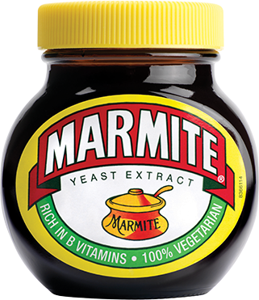

<!--
%\VignetteEngine{knitr::rmarkdown}
%\VignetteIndexEntry{Chapter 3 Slides}
-->

# `dplyr`: `plyr` v 2.0
```{r echo=FALSE}
options(digits = 3)
options(dplyr.print_min = 3, dplyr.print_max = 3)
```

## Overview

  * `dplyr` aims  to make standard data analysis easy
  * Few options
    - constraining your options, it simplifies how you can think about common data manipulation tasks
  * The __verbs__
  
## It's a naughty package

```{r}
library("dplyr")
```


# 3.0.1 The verbs
## 3.0.1 The verbs

Function | Usage
---------|------
`filter` | Filter rows
`select` | Select columns 
`mutate` |  Add/manipulate columns 
`arrange` | Sort the data 
`summarise` |  Summarise columns

## dplyr uses tibbles

```{r results="hide", message=FALSE}
library("dplyr")
data(ghg_ems, package="jrBig")
ghg_ems = tbl_df(ghg_ems)
```
```{r}
head(ghg_ems, 3)
```

## Tibbles vs data frame

  * Printing
  * tibbles are more strict: 
    * no partial matching, 
    * generate a warning if the column you are trying to access does not exist
  * S3 class magic

## `filter`

```{r message=FALSE}
## ghg_ems[!is.na(ghs_ems$ECO2),]
filter(ghg_ems, !is.na(ECO2))
```

## `select`

```{r message=FALSE}
## ghg_ems[, c("Country", "Year", "ECO2")]
select(ghg_ems, Country, Year, ECO2)
```
```{r message=FALSE}
select(ghg_ems, -1)
```

## `mutate` 

```{r}
## ghg_ems$total = ghg_ems$ECO2 + ghg_ems$MCO2
mutate(ghg_ems, total = ECO2 + MCO2)
```

## `arrange`

```{r}
## ghg_ems[order(ghg_ems$MCO2),]
arrange(ghg_ems, MCO2) #Try desc(MCO2)
```

## `summarise`

```{r}
## mean(ghg_ems$ECO2, na.rm=TRUE)
summarise(ghg_ems, mean(ECO2, na.rm=TRUE))
```

# Exercise 1
## Exercise 1
```{r eval=FALSE}
vignette("chapter3", package="jrBig")
```

## Linking

  * The first argument is a data frame.
  * The remaining arguments describe what to _do_ with the data frame.
  * The output is a data frame.


## 3.1 Data aggregation:  `group_by`

```{r}
by_country = group_by(ghg_ems, Country)
```

```{r}
summarise(by_country, 
          count = n(), #No. per group
          m_ECO2 = mean(ECO2), # Mean
          s_ECO2 = sd(ECO2)) # Std dev
```


# 3.1.1 Chain

## 3.1.1  Typical code
```{r}
x1 = select(ghg_ems, Country, ECO2, MCO2)
x2 = group_by(x1, Country)
x3 = summarise(x2, m_e = mean(ECO2, na.rm=TRUE), 
               m_m = mean(MCO2, na.rm=TRUE))
x4 = filter(x3, !is.na(m_e) | !is.na(m_m))
```
Or

```{r eval=FALSE}
select(group_by(summarise(....
```

# Piping
## Piping

```{r echo=FALSE}

```

## Piping

> Little bunny Foo Foo

> Went hopping through the forest

> Scooping up the field mice

> And bopping them on the head


## Each line has a function

```{r eval=FALSE}
foo_foo = little_bunny()
hop()
scoop()
bop()
```

## Intermediate steps

```{r eval=FALSE}
foo_foo_1 = hop(foo_foo, through = forest)
foo_foo_2 = scoop(foo_foo_1, up = field_mice)
foo_foo_3 = bop(foo_foo_2, on = head)
```
## Intermediate steps

```{r eval=FALSE}
foo_hop = hop(foo_foo, through = forest)
foo_scoop = scoop(foo_foo_1, up = field_mice)
foo_bop = bop(foo_foo_2, on = head)
```

## Overwrite the original

```{r eval=FALSE}
foo_foo = hop(foo_foo, through = forest)
foo_foo = scoop(foo_foo, up = field_mice)
foo_foo = bop(foo_foo, on = head)
```

## Function composition

```{R eval=FALSE}
bop(
  scoop(
    hop(foo_foo, through = forest),
    up = field_mice
  ), 
  on = head
)
```

## Pipe!

```{r eval=FALSE}
foo_foo %>%
  hop(through = forest) %>%
  scoop(up = field_mouse) %>%
  bop(on = head)
```

## Piping
```{r}
ghg_ems %>%
    select(Country, ECO2, MCO2) %>%
    group_by(Country) %>%
    summarise(m_e = mean(ECO2, na.rm=TRUE), 
               m_m = mean(MCO2, na.rm=TRUE)) %>%
    filter(!is.na(m_e) | !is.na(m_m))
```

# Exercise 2
## Exercise 2
```{r eval=FALSE}
vignette("chaptere", package="jrBig")
```

# 3.2 Databases

## 3.2 Databases

  * `dplyr` can seamlessly interact with databases
  * If your data fits in memory; then you probably don't need to worry about using a database
  * Currently `dplyr` supports the sqlite, mysql, postgresql, and google's bigquery.

## Dummy database

```{r -2:-1}
library(dplyr)
data(ghg_ems, package="jrBig")
db = src_sqlite(path=tempfile(), create = TRUE)
ghg_sqlite  = copy_to(db, ghg_ems, temporary = FALSE)
```

```{r echo=FALSE}
# Link to a table
ghg_sqlite = tbl(db, "ghg_ems")
## Or via SQL
ghg_sqlite = tbl(db, sql("SELECT * FROM ghg_ems"))
```

## Just like a normal data frame

```{r}
(mut = mutate(ghg_sqlite, total = ECO2 + MCO2))
```

## Generates SQL

```{r}
explain(mut)
```

## 3.2.1 Being lazy

`dplyr` is lazy
  
  * It never pulls data back to R unless you explicitly ask for it.
  * It delays doing any work until the last possible minute.
  * Force evaluation with `collect`

```{r eval=FALSE}
mut = collect(mut)
```

#  Exercise 3
## Exercise 3
```{r eval=FALSE}
vignette("chapter3", package="jrBig")
```
